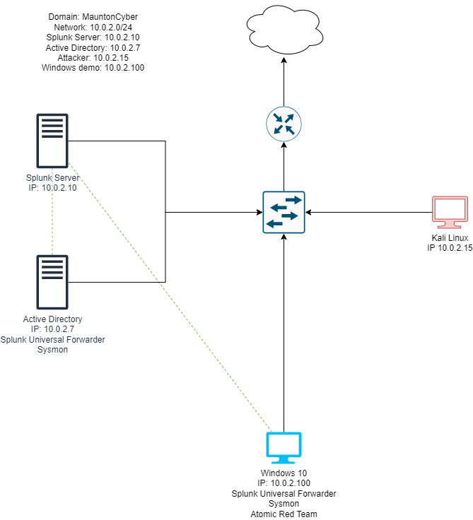
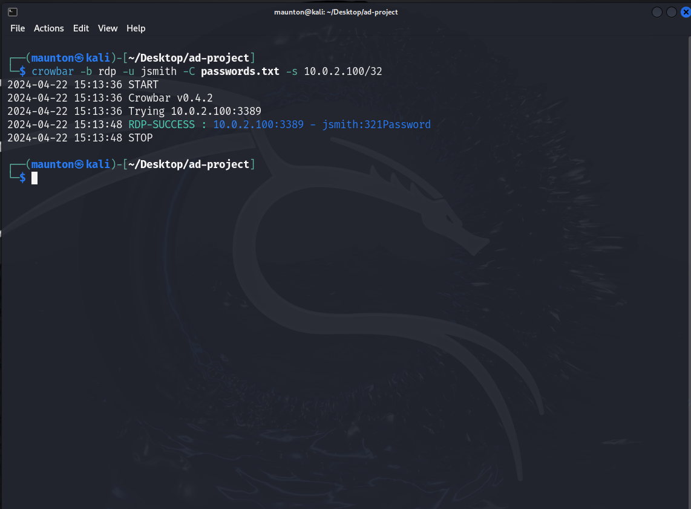
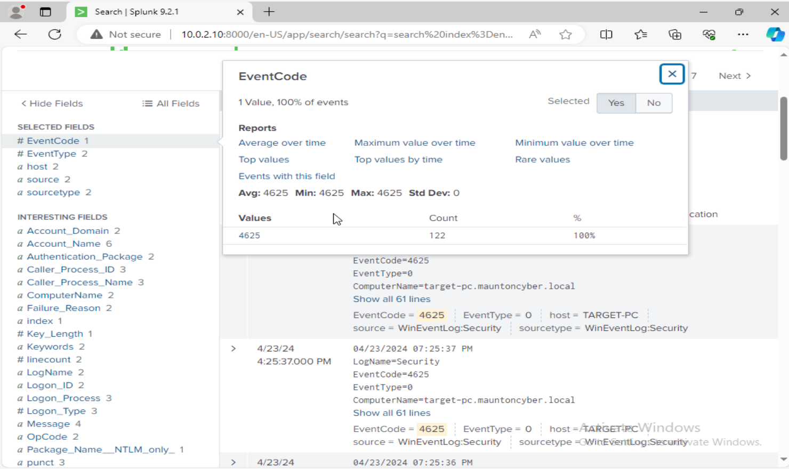
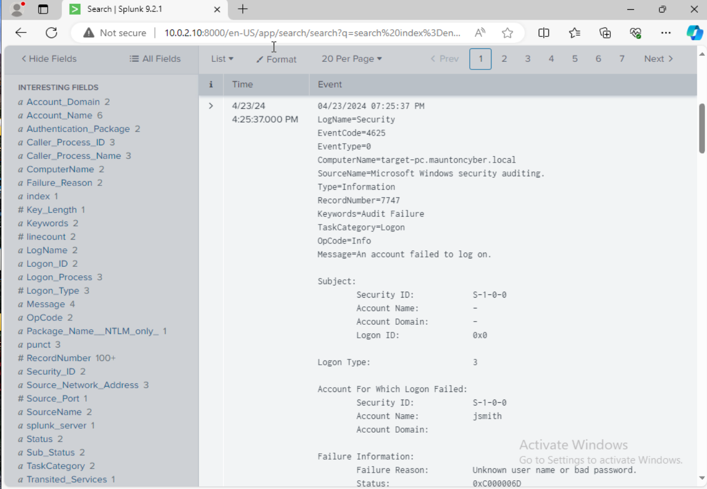
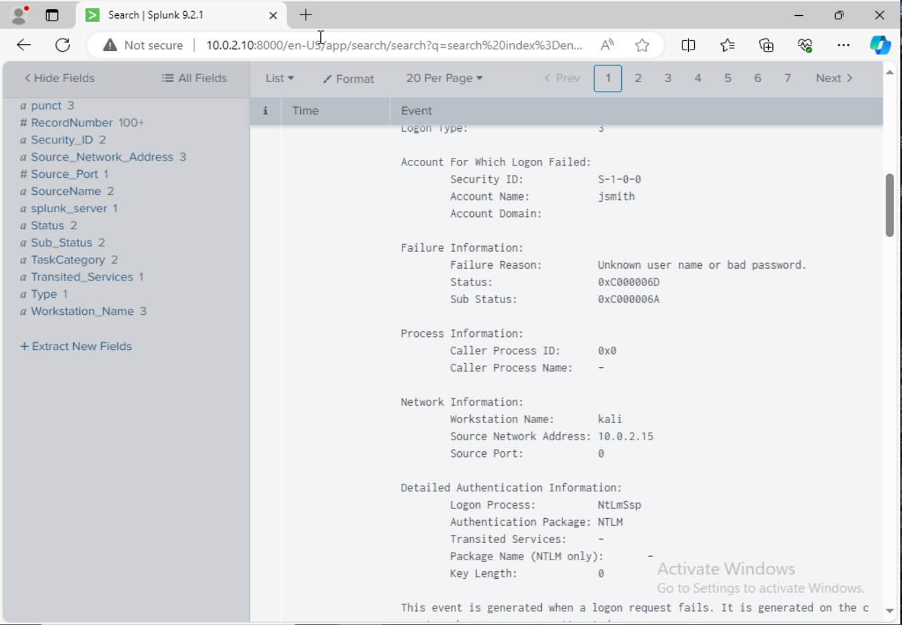
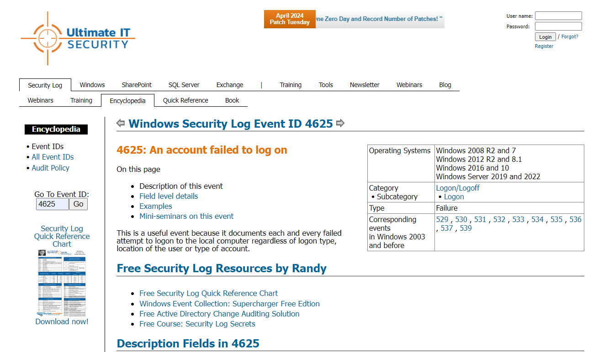

# Active Directory Security Monitoring Lab with Splunk

  
  
  
  
  

  A hands-on home lab project focused on monitoring Windows authentication activity, investigating failed logons, and validating security visibility in a controlled Active Directory environment.

---

## Table of Contents

- [Overview](#overview)
- [Recruiter Snapshot](#recruiter-snapshot)
- [Lab Objectives](#lab-objectives)
- [Environment](#environment)
- [Tools Used](#tools-used)
- [Network Diagram](#network-diagram)
- [Project Workflow](#project-workflow)
- [Key Findings](#key-findings)
- [Screenshots](#screenshots)
- [Skills Demonstrated](#skills-demonstrated)
- [What I Learned](#what-i-learned)
- [Future Improvements](#future-improvements)
- [Ethical Use Note](#ethical-use-note)

---

## Overview

This project demonstrates how I built a small Active Directory lab and used Splunk to monitor, search, and investigate Windows authentication events.

The main purpose of the lab was to generate failed authentication activity in a controlled environment, confirm that relevant Windows security logs were properly visible in Splunk, and investigate how suspicious login behavior can be identified through SIEM-based analysis.

This project is especially relevant to SOC analyst, junior cybersecurity, and blue-team roles because it highlights hands-on experience with log analysis, event correlation, security investigation, and home lab development.

---

## Recruiter Snapshot

**What this project shows at a glance:**

- Built a virtualized Active Directory lab with Windows and Linux systems
- Used Splunk to analyze Windows authentication activity
- Investigated repeated failed logons using Event ID 4625
- Correlated target account activity with source host and IP information
- Practiced SOC-style log review and security event triage
- Documented the workflow in a professional, employer-facing format

---

## Lab Objectives

The goal of this project was to validate security visibility around failed logon activity in an Active Directory environment.

### Objectives
- Build a realistic mini lab for Windows authentication monitoring
- Generate failed authentication events in a safe and isolated environment
- Verify that the events are captured and searchable in Splunk
- Investigate Windows Event ID 4625 activity
- Identify the volume, target account, and source system tied to the activity
- Strengthen practical SIEM and log analysis skills

---

## Environment

- VirtualBox
- Kali Linux
- Windows 10
- Windows Server 2022
- Ubuntu Server 22.04
- Active Directory lab
- Splunk

---

## Tools Used

- **Splunk** — log ingestion, search, event analysis, and visibility
- **Windows Event Logs** — authentication and failed logon telemetry
- **Active Directory** — centralized identity environment
- **Kali Linux** — lab-generated test activity
- **VirtualBox** — virtualization platform for the home lab

> Note: Controlled failed authentication activity was generated only inside the isolated lab for defensive monitoring and analysis.

---

## Network Diagram

  

---

## Project Workflow

### 1. Build the lab
I created a virtualized environment that included a Windows Server domain setup, a Windows 10 endpoint, Linux-based systems, and Splunk for centralized monitoring.

### 2. Generate failed authentication activity
To test detection visibility, I generated repeated failed login activity in the lab. This provided realistic authentication events for analysis without using any unauthorized targets.

### 3. Search and investigate in Splunk
Once the logs were available in Splunk, I searched for failed authentication patterns and reviewed relevant security events, especially Windows Event ID 4625.

### 4. Correlate the activity
I reviewed the results to determine:
- how many failures occurred
- which account was targeted
- what system generated the activity
- what source IP or workstation information was available
- which event details were useful during triage

### 5. Validate defensive visibility
The lab confirmed that failed authentication behavior could be surfaced quickly in Splunk and used to support security investigation workflows.

---

## Key Findings

- Failed logon activity was clearly visible in Splunk
- Event ID 4625 provided useful failed authentication details
- Repeated authentication failures could be counted and investigated
- The targeted account behavior could be correlated with source information
- Source machine and IP visibility improved investigative context
- Splunk provided a strong foundation for detection and analysis in the lab

---

## Screenshots

### Network Diagram

  

---

### Failed Authentication Activity Generated in the Lab

  

---

### Splunk Search Showing Event ID 4625 Counts

  

---

### Repeated Failed Logons for the Target Account

  

---

### Source Host and IP Visibility in Splunk

  

---

### Event ID 4625 Details

  

---

## Skills Demonstrated

### Security Operations / Blue-Team Skills
- SIEM monitoring and analysis
- Windows authentication log investigation
- Event ID 4625 failed logon analysis
- Basic detection validation in a lab environment
- Source attribution using log data
- Security triage and pattern identification

### Technical Skills
- Splunk search and investigation
- Windows event log interpretation
- Active Directory lab setup
- VirtualBox-based environment building
- Linux and Windows interoperability in a home lab
- Security-focused documentation and reporting

---

## What I Learned

This project strengthened my understanding of how Windows authentication failures appear in log data and how a SIEM can be used to investigate suspicious login behavior.

It also helped reinforce the importance of:
- centralizing logs for visibility
- understanding Windows event codes
- validating security telemetry in a lab
- correlating account activity with source system information
- documenting technical work in a clear, professional format

---

## Future Improvements

- Build custom Splunk dashboards for failed logon trends
- Add alerts for repeated authentication failures
- Expand coverage to successful logons and account lockouts
- Include additional Windows event IDs related to authentication
- Add a detection mapping section for common security use cases
- Create a small incident-response style investigation workflow for the lab

---

## Ethical Use Note

This project was conducted in a controlled home lab for defensive learning, security monitoring validation, and log analysis practice. No activity was performed against unauthorized systems.

---
